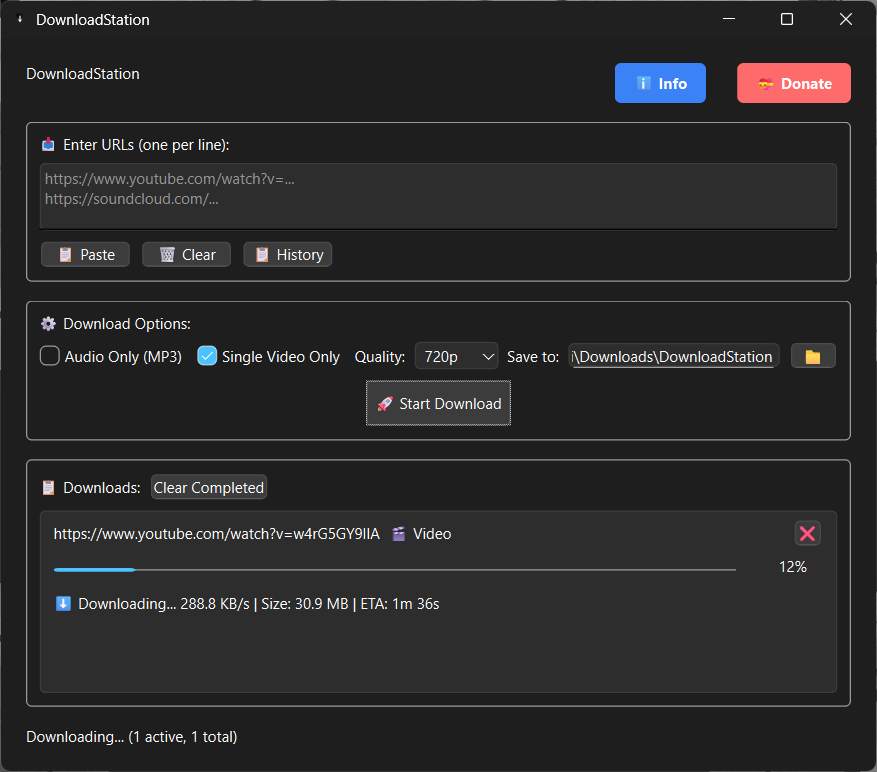
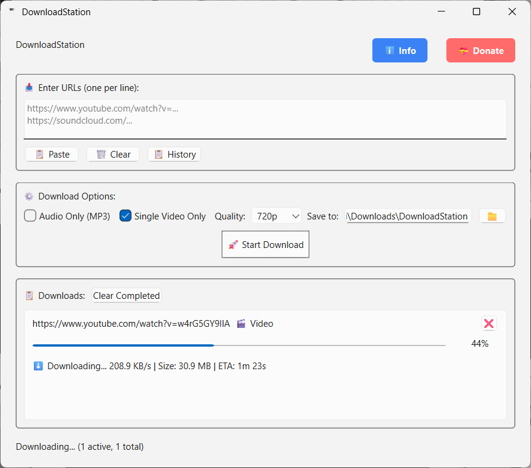
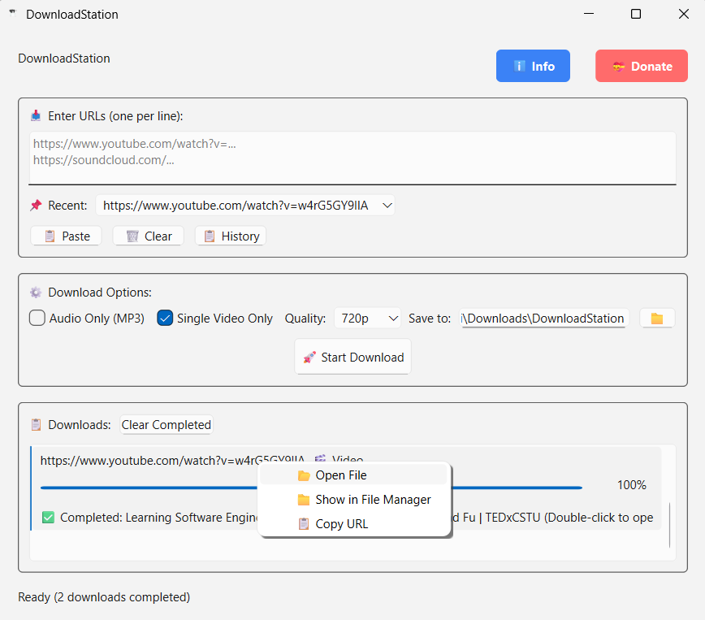

# DownloadStation

A modern, feature-rich video and audio downloader built with PyQt6 and yt-dlp. Download videos from 1000+ platforms including YouTube, Vimeo, SoundCloud, and more.

## Features

### Core Functionality
- **Multi-platform support**: Download from YouTube, Vimeo, SoundCloud, TikTok, and 1000+ other platforms
- **Quality selection**: Choose from 480p, 720p, 1080p, or Best available quality
- **Audio extraction**: Download audio-only files in MP3 format
- **Playlist support**: Load playlists and select specific videos to download
- **Batch downloads**: Process multiple URLs simultaneously

### Advanced Features
- **Smart playlist handling**: Interactive playlist selection with video previews
- **Progress tracking**: Real-time download progress with speed, file size, and ETA
- **Download management**: Pause, cancel, and retry downloads
- **File interaction**: Double-click to open files, right-click for context menu
- **Settings persistence**: Remembers your preferences and download history

### User Interface
- **Modern design**: Clean, intuitive interface with dark theme support
- **Recent URLs**: Quick access to previously used URLs
- **Download history**: Track all downloads with success/failure status
- **Responsive UI**: Real-time updates and smooth user experience

## Screenshots

## Screenshots

### Main Interface


### Download Progress Dark Mode


### Download Progress Light Mode




## Installation

### Prerequisites
- Python 3.8 or higher
- Windows 10/11 (primary platform)
- FFmpeg [Download](https://ffmpeg.org/download.html)

### From Source

1. Clone the repository:
```bash
git clone https://github.com/adichris/DownloadStation.git
cd DownloadStation
```

2. Create a virtual environment:
```bash
python -m venv .venv
.venv\Scripts\activate  # Windows
```

3. Install dependencies:
```bash
pip install -r requirements.txt
```

4. Run the application:
```bash
python main.py
```

### Binary Release

Download the latest compiled executable from the [Releases](https://github.com/adichris/DownloadStation/tree/master/releases) page.

Windows Executable [Windows PC](https://github.com/adichris/DownloadStation/blob/master/releases/DownloadStation.exe)
## Usage

### Basic Download
1. Paste video URL in the input field
2. Select quality and format options
3. Choose download location
4. Click "Start Download"

### Playlist Downloads
1. Uncheck "Single Video Only"
2. Paste playlist URL
3. Wait for playlist to load
4. Select videos you want to download
5. Click "Download Selected"

### Audio Extraction
1. Check "Audio Only (MP3)"
2. Paste video URL
3. Start download to get MP3 file

## Supported Platforms

### Popular Video Platforms
- YouTube (videos, playlists, live streams)
- Vimeo
- Dailymotion
- Facebook (public videos)
- Instagram (videos, stories, reels)
- TikTok
- Twitter/X (videos)
- Reddit (videos)

### Audio Platforms
- SoundCloud
- Bandcamp
- YouTube Music

### Educational Platforms
- Coursera
- Udemy
- Khan Academy
- edX
- LinkedIn Learning

### Entertainment & News
- Twitch (VODs, clips)
- BBC iPlayer
- CNN
- ESPN

*And 1000+ more platforms supported by yt-dlp*

## Project Structure

```
DownloadStation/
├── main.py                 # Application entry point
├── ui/
│   ├── main_window.py      # Main application window
│   └── dialogs.py          # Dialog windows (playlist, info, donate)
├── core/
│   ├── download_thread.py  # Download handling
│   ├── playlist_loader.py  # Playlist processing
│   └── settings.py         # Settings management
├── requirements.txt        # Python dependencies
├── setup.py               # Build configuration
└── README.md              # This file
```

## Building from Source

### Using PyInstaller (Recommended)
```bash
pip install pyinstaller
pyinstaller --onefile --windowed --icon=logo.ico --name "DownloadStation" main.py
```

### Using cx_Freeze
```bash
python setup.py build
```

## Configuration

The application automatically saves settings including:
- Download quality preferences
- Audio/video format selection
- Download location
- Window size and position
- Recent URLs and download history

Settings are stored in `settings.json` in the application directory.

## Dependencies

### Core Dependencies
- **PyQt6**: GUI framework
- **yt-dlp**: Video download engine
- **plyer**: System notifications

### Optional Dependencies
- **FFmpeg**: Required for audio conversion (auto-downloaded if needed)

See `requirements.txt` for complete dependency list.

## Contributing

1. Fork the repository
2. Create a feature branch (`git checkout -b feature/amazing-feature`)
3. Commit your changes (`git commit -m 'Add amazing feature'`)
4. Push to the branch (`git push origin feature/amazing-feature`)
5. Open a Pull Request

### Development Setup
```bash
git clone https://github.com/adichris/DownloadStation.git
cd DownloadStation
python -m venv .venv
.venv\Scripts\activate
pip install -r requirements.txt
pip install -r requirements-dev.txt  # Development dependencies
```

## License

This project is licensed under the MIT License - see the [LICENSE](LICENSE) file for details.

## Acknowledgments

- [yt-dlp](https://github.com/yt-dlp/yt-dlp) - Powerful video download library
- [PyQt6](https://www.riverbankcomputing.com/software/pyqt/) - Cross-platform GUI toolkit
- [FFmpeg](https://ffmpeg.org/) - Multimedia processing

## Support

### Getting Help
- Check the [Issues](https://github.com/adichris/DownloadStation.git/issues) page
- Read the [Wiki](https://github.com/adichris/DownloadStation.git/wiki) for detailed documentation
- Contact: adichriz@gmail.com

### Reporting Issues
When reporting bugs, please include:
- Operating system and version
- Python version
- Error messages or logs
- Steps to reproduce the issue

### Feature Requests
Have an idea for a new feature? Open an issue with the "enhancement" label.

## Donation

If you find DownloadStation useful, consider supporting development:

- **MTN Mobile Money**: 0599784780
- **Telecel Cash**: 0502961714
- **Email**: adichriz@gmail.com

## Changelog

### v1.0.0 (Latest)
- Initial release
- Multi-platform video downloading
- Playlist support with video selection
- Audio extraction to MP3
- Modern PyQt6 interface
- Download progress tracking
- Settings persistence

## Roadmap

- [ ] Download scheduling
- [ ] Browser integration
- [ ] Subtitle download support
- [ ] Custom output naming templates
- [ ] Download speed limiting
- [ ] Proxy support

---

**Note**: This software is for personal use only. Respect content creators' rights and platform terms of service.